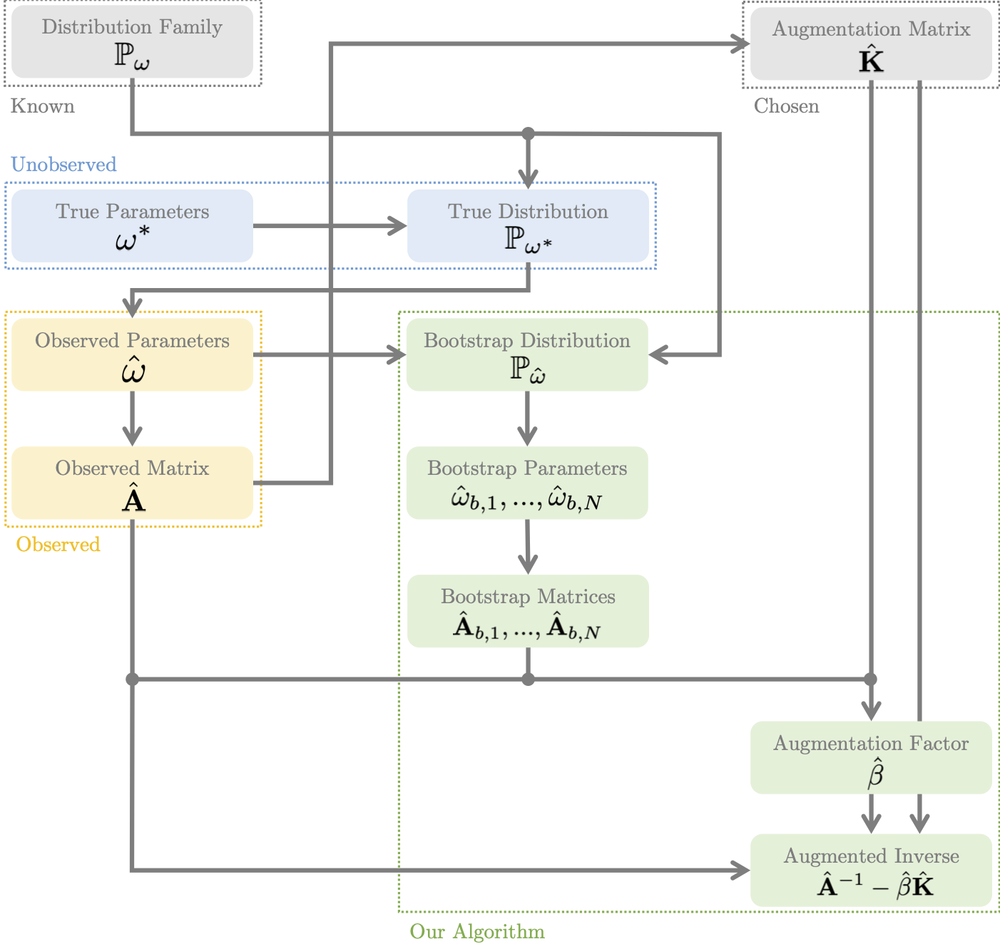

# Python Operator Augmentation

Python implementation of the methods in our paper "Operator Augmentation for Elliptic Systems,"
as well as a testbed of problems to benchmark performance. This python testbed is less
performant and documented than the C++ implementation, and so we recommended it only for prototyping.

# Dependencies

This testbed requires:

* **Numpy**.
* **Scipy**.
* **NetworkX**.

I recommend you use the Anaconda distribution of Python.

# Code Structure and Usage

The code structure more or less parallels the structure of the C++ code. Indeed, the C++ implementation is more or less a port of the Python implementation. Since documentation for the two is more or less interchangeable, I recommend you see the README of the [C++ Version](https://github.com/UniqueUpToPermutation/OperatorAugmentationCPP) for guidelines on usage, since most of what is written there applies almost verbatim to this implementation.

Unlike in C++, there is no central program to call the provided examples. Instead we simply provide individual Python scripts that parallel their respective C++ examples:

* **dgn_graph_laplacian.py**: A graph Laplacian example where every edge is perturbed by a random variable.
* **dgn_grid_laplacian.py**: A 1D grid Laplacian example perturbed by noise.
* **dgn_grid_laplacian_2d.py**: A 2D grid Laplacian example perturbed by noise.